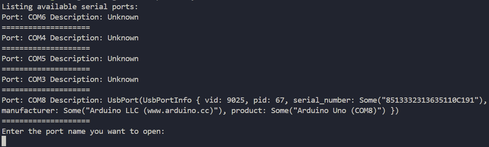
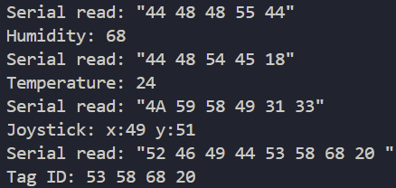

<h1 align="center">SCADA - Arduino Hardware</h1> 

<p align="center">
<a href="https://www.rust-lang.org/">
  
</a>
<a href="#">
  
</a>
<a href="#">
  
</a>
</p>

### This project is an command line interface supervisory system that uses serial communication connected  to a hardware. It was created for the purpose of study and technological improvement.

## What is SCADA?
A supervisory system, also known as SCADA (Supervisory Control and Data Acquisition), is a software and hardware system that enables the monitoring and control of large-scale industrial or infrastructure processes.

It collects real-time data from sensors and devices, processes and displays this information, allowing operators to make informed decisions and perform control actions.

## Related Projects
### [SCADA - Arduino Hardware](https://github.com/thiagoelias99/scada-arduino/tree/main)
Arduino hardware used to communicate with this project.

## UI
### Serial ports list.
<p align="center">

</p>

### Data Visualization
<p align="center">

</p>

## Project Installation && Execution
### Requirements
- Windows, Linux, MacOS OS.
- [Rust installation](https://www.rust-lang.org/tools/install)
### Installation
1. Clone this project to local machine.
### Execution
1. In project root use cli cmd ```cargo run```.
2. Type a available serial port.
3. Them data acquisition starts automatically.

## Serial Communication Patterns
- **Humidity** (send): 
  - **44 48 48 55 (VALUE IN HEX)**
  - 44 48 48 55 3C -> 60%
  - 44 48 48 55 14 -> 20%
- **Temperature** (send): 
  - **44 48 54 45 (VALUE IN HEX)**
  - 44 48 54 45 19 -> 25%
  - 44 48 54 45 25 -> 37%
- **Joystick** (send): 
  - **4A 59 58 49 (X VALUE IN HEX) (Y VALUE IN HEX)**
  - 4A 59 58 49 1E 36 -> X=30 Y=70
  - 4A 59 58 49 32 00 -> X=50 Y=0
- **RFID** (send): 
  - **52 46 49 44 (ID IN HEX)**
  - 52 46 49 44 53 58 68 20 -> Tag ID = 83 88 104 32